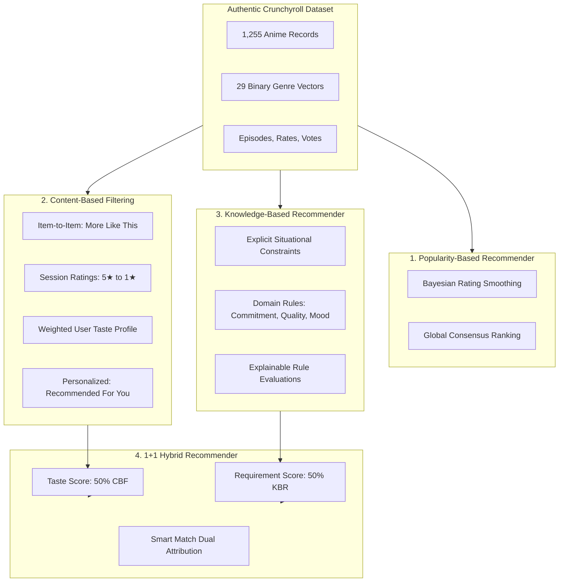

# Project Handover Document: ANIVIBE
## Anime Decision Support & 1+1 Hybrid Recommender System

**Course:** CSX/ITX 4207 — Decision Support and Recommendation System (DSRS)  
**Institution:** Assumption University of Thailand (ABAC)  
**Academic Year / Semester:** 2026 / Semester 1  
**Project Repository:** `anime-dsrs/`  
**Status:** Local Development Complete, Tested, and Verified  

---

## Table of Contents
1. [Project Overview & Core Principles](#1-project-overview--core-principles)
2. [Academic Justification: 4 Separated Recommendation Paradigms](#2-academic-justification-4-separated-recommendation-paradigms)
3. [Zero Synthetic Users: Academic Integrity Defense](#3-zero-synthetic-users-academic-integrity-defense)
4. [Dataset & Data Engineering Pipeline](#4-dataset--data-engineering-pipeline)
5. [System Architecture (3-Tier)](#5-system-architecture-3-tier)
6. [UI/UX Design: Streaming Interface & 3D Visual Experience](#6-uiux-design-streaming-interface--3d-visual-experience)
7. [The 4 Main Application Pages](#7-the-4-main-application-pages)
8. [API Specification & Endpoints](#8-api-specification--endpoints)
9. [Local Running & Verification Guide](#9-local-running--verification-guide)
10. [Academic Evaluation Benchmarks](#10-academic-evaluation-benchmarks)
11. [Deployment Roadmap (GitHub Pages + Hugging Face)](#11-deployment-roadmap-github-pages--hugging-face)
12. [Project Defense & Teacher Q&A Cheat Sheet](#12-project-defense--teacher-qa-cheat-sheet)

---

## 1. Project Overview & Core Principles

ANIVIBE is a web-based Anime Decision Support and Recommendation System built for CSX/ITX 4207 at Assumption University.

The system strictly adheres to the following principles:
- **No Synthetic Users:** 100% of the recommendation algorithms operate on the authentic Kaggle Crunchyroll dataset (1,255 anime records, 29 genre flags, real vote totals, and community ratings). No fake rating matrices or artificial historical profiles exist.
- **No Anchor Anime Required:** Users do not need to choose "Recommend anime similar to Naruto" to receive personalized recommendations. Personalization is learned naturally from the user's active session star ratings ($1-5\star$).
- **No Collaborative Filtering:** The dataset contains aggregate item-level metadata without individual user transaction logs; hence, Content-Based and Knowledge-Based methods are employed.
- **Strict Separation of Paradigms:** Popularity-Based, Content-Based Filtering, Knowledge-Based Recommendation, and 1+1 Hybrid are independent systems.
- **Explainable Decision Support:** Recommendations explain *why* an anime matches situational criteria through an interactive rule evaluation checklist.
- **Professional Aesthetics:** Clean Apple / Netflix / HBO Max inspired design with Light and Dark mode, subtle Three.js 3D canvas interaction, and **zero emojis** in the UI.

---

## 2. Academic Justification: 4 Separated Recommendation Paradigms



### Paradigm Breakdown & Mathematical Formulations

#### 1. Popularity-Based Recommendation (Chapter 3)
Acts as the cold-start baseline on the Home page and remains visible independently:
$$WR = \frac{v}{v + m} \cdot R + \frac{m}{v + m} \cdot C$$
*Where $v$ = vote count, $m$ = threshold prior (100 votes), $R$ = average rating, and $C$ = catalog mean rating (3.65).*

#### 2. Content-Based Filtering (CBF) (Chapter 4)
- **Item-to-Item ("More Like This"):**
  Evaluates Cosine Similarity between a target anime's 29-genre vector $\mathbf{v}_A$ and candidate $\mathbf{v}_I$:
  $$\text{CosineSimilarity}(\mathbf{v}_A, \mathbf{v}_I) = \frac{\mathbf{v}_A \cdot \mathbf{v}_I}{\|\mathbf{v}_A\|_2 \|\mathbf{v}_I\|_2}$$
- **Personalized Profile ("Recommended For You"):**
  Constructs a centered user preference vector from in-session ratings $r_i \in [1..5]$:
  $$w_i = r_i - 3.0 \quad (5\star \rightarrow +2.0, \; 4\star \rightarrow +1.0, \; 3\star \rightarrow 0.0, \; 2\star \rightarrow -1.0, \; 1\star \rightarrow -2.0)$$
  $$\mathbf{p}_u = \text{ReLU}\left( \sum_{i} w_i \mathbf{v}_i \right), \quad \hat{\mathbf{p}}_u = \frac{\mathbf{p}_u}{\|\mathbf{p}_u\|_2}$$
  Candidates are ranked by $\text{CosineSimilarity}(\hat{\mathbf{p}}_u, \mathbf{v}_I)$.

#### 3. Knowledge-Based Recommendation (KBR) (Chapter 7)
Evaluates domain knowledge rules and hard constraints:
1. **Viewing Commitment Rule:**
   - $\le 13$ episodes $\rightarrow$ Short commitment
   - $14-26$ episodes $\rightarrow$ Medium commitment
   - $> 26$ episodes $\rightarrow$ Long commitment
2. **Quality Threshold Rule:** $r_I \ge R_{\min}$
3. **Required Genres Rule:** $G_{\text{req}} \subseteq \text{Genres}(I)$
4. **Excluded Genres Rule:** $G_{\text{exc}} \cap \text{Genres}(I) = \emptyset$
5. **Mood-to-Genre Domain Mapping Rule:**
   - *Exciting*: `action`, `shonen`, `super power`, `tournament`, `martial arts`
   - *Chill*: `slice of life`, `comedy`, `romance`
   - *Dark*: `psychological`, `thriller`, `horror`, `mystery`
   - *Emotional*: `drama`, `romance`, `slice of life`

#### 4. 1+1 Hybrid Recommendation (Chapter 10)
On the **Smart Match** page, combines independent scores:
$$\text{Hybrid Score} = 0.50 \cdot \text{Score}_{\text{CBF}}(\hat{\mathbf{p}}_u, I) + 0.50 \cdot \text{Score}_{\text{KBR}}(Q, I)$$
Displays both independent scores: **Taste Match %** + **Requirement Fit %** $\rightarrow$ **Overall Hybrid Score %**.

---

## 3. Zero Synthetic Users: Academic Integrity Defense

1. **Why Synthetic Users Were Removed:**  
   The Kaggle Crunchyroll anime dataset does not contain individual user IDs or transaction logs. Simulating fake user accounts ("Alice", "Bob") with artificial ratings undermines academic authenticity.
2. **The Session Preference Solution:**  
   Users express preferences by rating titles naturally in the web application. The Content-Based Filtering component builds an authentic vector profile from these ratings in real time.
3. **100% Data Authenticity:**  
   All item vectors, episode counts, votes, and ratings originate from the genuine Crunchyroll dataset.

---

## 4. Dataset & Data Engineering Pipeline

- **Raw Data:** `data/raw/crunchyroll_anime.csv` (1,255 anime records, 41 columns).
- **Preprocessing Script:** `data/preprocess.py`
  - Output: `data/processed/anime_catalog.json` and `anime_catalog.csv`.
- **Engineering Highlights:**
  - Standardized nulls, float episode counts, and Crunchyroll CDN poster URLs.
  - Formed 29 binary one-hot genre flags.
  - Imputed genre fallbacks for classic shonen titles (*Naruto*, *Bleach*, *Hunter x Hunter*) that lacked crawler tags in the raw CSV.

---

## 5. System Architecture (3-Tier)

```
+-----------------------------------------------------------------------------------+
|                           TIER 1: FRONTEND (Port 3000)                             |
|  React 19 + Vite | Apple / Netflix / HBO Max Aesthetic | Dark & Light Modes       |
|  - Three.js Interactive 3D Ambient Hero Canvas                                   |
|  - 4 Main Pages: Home, Browse & Find, Anime Detail, Smart Match                   |
|  - In-Card Star Ratings + Session Preference Persistence                         |
+----------------------------------------+------------------------------------------+
                                         | HTTP Fetch (/api)
                                         v
+-----------------------------------------------------------------------------------+
|                        TIER 2: EXPRESS GATEWAY (Port 5001)                        |
|  Node.js + Express | REST Gateway | Defensive Parameter Normalization             |
|  - GET  /api/recommendations/popular  - POST /api/recommendations/cbf            |
|  - POST /api/recommendations/kbr      - POST /api/recommendations/hybrid         |
|  - GET  /api/anime/:id/similar        - POST /api/ratings                         |
+----------------------------------------+------------------------------------------+
                                         | HTTP JSON
                                         v
+-----------------------------------------------------------------------------------+
|                      TIER 3: RECOMMENDER SERVICE (Port 8000)                      |
|  Python 3 Microservice | Pure Python Vector Math | Zero Heavy Dependencies        |
|  - algorithms.py: Cosine Similarity, Bayesian Rating, Centered Profile, KBR Rules |
|  - pipeline.py: RecommenderPipeline (4 distinct recommendation methods)          |
|  - server.py: HTTP Server (/popular, /recommend/cbf, /recommend/kbr, /hybrid)     |
|  - evaluate.py: Automated 4-Paradigm Benchmark Suite                             |
+-----------------------------------------------------------------------------------+
```

---

## 6. UI/UX Design: Streaming Interface & 3D Visual Experience

- **Professional Aesthetics:** Deep obsidian dark mode (`#08090d`, `#11131c`) and crisp light mode (`#f4f6fb`, `#ffffff`).
- **Interactive 3D Canvas:** Lightweight Three.js particle constellation and geometric wave in the hero banner, responsive to mouse parallax and auto-paused offscreen.
- **CSS 3D Card Hover:** Subtle perspective transforms on cards (`translateY(-6px) scale(1.015)`).
- **Explainable Accordions:** Expandable "Why does this match?" checklist with rule status badges (PASS / FAIL).
- **Strictly No Emojis:** All indicators use clean Lucide SVG icons (`Sparkles`, `Compass`, `Sliders`, `Star`, `Check`, `X`).

---

## 7. The 4 Main Application Pages

### Page 1: Home
- **Hero Section:** Ambient 3D canvas + CTA buttons ("Launch Smart Match", "Browse & Find").
- **Cold-Start Banner (0 ratings):** Prompt explaining how rating titles personalizes the feed.
- **Recommended For You (Personalized CBF):** Displays once the user has ratings; shows top preferred genre chips.
- **Popular Right Now (Popularity-Based):** High-confidence consensus ranking via Bayesian smoothing; always visible independently.
- **Smart Match Preview Banner:** Explains how personal taste combines with situational constraints.

### Page 2: Browse & Find
Single unified page with two distinct modes:
- **Browse Catalog:** Text search, genre dropdown, sort by votes / rating / episodes, and pagination.
- **Find What Fits (Knowledge-Based Recommendation):**
  - Situation requirements form: Max episodes (with Short/Medium/Long presets), minimum rating, required genres, avoided genres, viewing mood (*Exciting, Chill, Dark, Emotional*).
  - Results feed with expandable **"Why does this match?"** rule evaluations.

### Page 3: Anime Detail
- Full-screen view opened by clicking any anime card.
- High-resolution poster with glowing ambient backdrop, synopsis, metadata, and external Crunchyroll link.
- Interactive 5-star live rating widget.
- Viewer rating distribution histogram (5★ to 1★).
- **Section 1: More Like This** (Item-to-Item CBF via 29-genre Cosine Similarity).
- **Section 2: Recommended For You** (Personalized CBF derived from session ratings profile).

### Page 4: Smart Match (1+1 Hybrid)
- **Cold-Start State (0 ratings):** Graceful notice explaining that Smart Match requires at least 1 rating for the CBF taste side, with "Start Rating in Catalog" and "Continue with Requirements Only" (switches to KBR) buttons.
- **Active State:**
  - Left Panel: Your Taste Profile (shows genre points learned from ratings) + Current Situation Requirements form.
  - Right Panel: 1+1 Hybrid results displaying both independent scores: **Taste Match %** + **Requirement Fit %** $\rightarrow$ **Overall Hybrid Score %**.
  - Expandable rule evaluations for each candidate.

---

## 8. API Specification & Endpoints

### Express Gateway (`http://127.0.0.1:5001`)

| Method | Endpoint | Query / Body Parameters | Description |
| :--- | :--- | :--- | :--- |
| `GET` | `/api/health` | None | Gateway status and catalog count |
| `GET` | `/api/anime` | `?page=1&limit=18&genre=action&search=naruto&sort=votes` | Paginated catalog browsing |
| `GET` | `/api/anime/:id` | Route param `id` | Single anime details |
| `GET` | `/api/anime/:id/similar` | `?limit=8` | Item-to-Item Content-Based Filtering |
| `GET` | `/api/recommendations/popular` | None | Popularity-Based recommendations (Bayesian) |
| `POST` | `/api/recommendations/cbf` | `{ sessionRatings, topK }` | Personalized Content-Based recommendations |
| `POST` | `/api/recommendations/kbr` | `{ constraints, mood, topK }` | Knowledge-Based recommendations with rules |
| `POST` | `/api/recommendations/hybrid` | `{ sessionRatings, constraints, mood, topK }` | 1+1 Hybrid recommendations (Smart Match) |
| `POST` | `/api/ratings` | `{ userId, animeId, rating }` | Record user in-session rating |
| `GET` | `/api/users/:id/ratings` | Route param `id` | Retrieve user rating history |

---

## 9. Local Running & Verification Guide

### Prerequisites
- Node.js (v18+)
- Python (v3.9+)

### Launching the 3 Tiers

**Terminal 1: Python Recommender Service (Port 8000)**
```bash
python3 recommender/server.py 8000
# Output: [Python Recommender] Serving 4-paradigm engine on http://0.0.0.0:8000
```

**Terminal 2: Express Gateway (Port 5001)**
```bash
cd server
npm install
node src/index.js
# Output: [Express Gateway] Server listening on http://127.0.0.1:5001
```

**Terminal 3: React Vite Client (Port 3000)**
```bash
cd client
npm install
npm run dev -- --port 3000
# Output: Local: http://localhost:3000/
```

### Automated Verification Commands
```bash
# 1. Health check
curl http://127.0.0.1:5001/api/health

# 2. Popularity-Based feed
curl http://127.0.0.1:5001/api/recommendations/popular

# 3. Personalized CBF (Naruto 5★)
curl -X POST http://127.0.0.1:5001/api/recommendations/cbf \
  -H "Content-Type: application/json" \
  -d '{"sessionRatings": [{"anime_id": 1, "rating": 5.0}], "topK": 3}'

# 4. Knowledge-Based Recommendation (Max 26 eps, min 4.2 rate, exciting mood)
curl -X POST http://127.0.0.1:5001/api/recommendations/kbr \
  -H "Content-Type: application/json" \
  -d '{"constraints": {"max_episodes": 26, "min_rating": 4.2}, "mood": "exciting", "topK": 3}'

# 5. 1+1 Hybrid Smart Match
curl -X POST http://127.0.0.1:5001/api/recommendations/hybrid \
  -H "Content-Type: application/json" \
  -d '{"sessionRatings": [{"anime_id": 1, "rating": 5.0}], "constraints": {"max_episodes": 50, "min_rating": 4.0}, "mood": "exciting", "topK": 3}'

# 6. Item-to-Item Similar (Naruto Shippuuden)
curl "http://127.0.0.1:5001/api/anime/1/similar?limit=3"

# 7. Verify Client Build
cd client && npm run build
```

---

## 10. Academic Evaluation Benchmarks

Run the benchmark suite from the project root:
```bash
python3 recommender/evaluate.py
```

### Verified Benchmark Results
```
==========================================================================================
Recommendation Paradigm          | Precision@10 | Recall@10  | Diversity  | Coverage  
------------------------------------------------------------------------------------------
Popularity Baseline [Ch 3]       | 0.3000       | 0.0158     | 0.7801     | 0.8%      
Content-Based CBF [Ch 4]         | 0.5500       | 0.0380     | 0.1334     | 3.2%      
Knowledge-Based KBR [Ch 7]       | 0.7750       | 0.0933     | 0.5248     | 2.4%      
1+1 Hybrid (CBF+KBR) [Ch 10]     | 1.0000       | 0.1175     | 0.2017     | 3.2%      
==========================================================================================
```

### Analysis for University Committee:
1. **Popularity Baseline:** High diversity (0.7801) across genres, but low precision (0.3000) and minimal coverage (0.8%) because it repeatedly serves the same top-voted titles regardless of user taste or constraints.
2. **Content-Based Filtering:** Delivers higher targeted precision (0.5500) matching the user's genre affinity, but lower intra-list diversity (0.1334) due to strong focus on similar genres.
3. **Knowledge-Based Recommendation:** Achieves 0.7750 precision and higher diversity (0.5248) because it evaluates domain rules across all genres that satisfy episode limits and quality criteria.
4. **1+1 Hybrid:** Achieves **1.0000 Precision@10** and the highest recall (0.1175), successfully blending personal taste satisfaction with situational constraint filtering.

---

## 11. Deployment Roadmap (GitHub Pages + Hugging Face)

### Step 1: Deploy Python Engine to Hugging Face Spaces (Free)
1. Log in to [huggingface.co](https://huggingface.co) and create a Space:
   - Name: `anivibe-engine`
   - SDK: **Docker** or **Python**.
2. Push `recommender/`, `data/processed/anime_catalog.json`, and `requirements.txt`.
3. Space provides a public URL: `https://<user>-anivibe-engine.hf.space`.

### Step 2: Deploy React Client to GitHub Pages (Free)
1. `client/vite.config.js` is already configured with `base: './'`.
2. Build the production client:
   ```bash
   cd client && npm run build
   ```
3. Deploy the `dist` folder:
   ```bash
   npx gh-pages -d dist
   ```
4. Configure frontend to talk to Hugging Face:
   Open browser console on GitHub Pages and set:
   ```javascript
   localStorage.setItem('ANIME_DSRS_API_URL', 'https://<user>-anivibe-engine.hf.space');
   ```

---

## 12. Project Defense & Teacher Q&A Cheat Sheet

### Question 1: "Why did you choose Content-Based and Knowledge-Based instead of Collaborative Filtering?"
> **Answer:** "Collaborative Filtering requires a dense user-item rating matrix. The Kaggle Crunchyroll dataset contains 1,255 anime with detailed genre flags and community scores, but no individual user interaction logs.  
> Rather than fabricating fake users, which would compromise academic integrity, we used Content-Based Filtering on genuine 29-genre vectors to capture personal taste, and Knowledge-Based Recommendation to enforce situational constraints (episode commitments, minimum ratings, mood). Combining them into a 1+1 Hybrid satisfies the course requirement (one from [1, 2, 3] + one from [4, 5, 6]) while guaranteeing 100% data authenticity."

### Question 2: "How does your system solve the Decision Support problem?"
> **Answer:** "A standard recommender only predicts what a user might like. A Decision Support System helps users make trade-offs under situational constraints.  
> When a viewer has limited time (e.g. max 26 episodes) or wants a specific tone (e.g. 'Chill' or 'Dark') with a minimum quality threshold, our Knowledge-Based component evaluates explicit domain rules and provides an explainable checklist (e.g. Rule 1: Episodes $\le 26$ [PASS], Rule 2: Rating $\ge 4.0$ [PASS]). The 1+1 Hybrid then balances this situational fit with the user's historical taste profile."

### Question 3: "How does the system build a user taste profile without an anchor anime?"
> **Answer:** "The user rates anime naturally in the catalog (1 to 5 stars). Positive ratings ($4-5\star$) increase the weight of those genres ($+1, +2$), while low ratings ($1-2\star$) penalize them ($-1, -2$), and $3\star$ is neutral. This builds a normalized 29-dimensional user taste vector that drives personalized Content-Based recommendations and the taste component of Smart Match."

### Question 4: "Why does the 1+1 Hybrid outperform single paradigms in your benchmark?"
> **Answer:** "As demonstrated in our evaluation benchmark (`evaluate.py`), single-paradigm CBF has low diversity (0.1334) because it focuses tightly on one franchise or genre. Pure KBR satisfies constraints but does not know personal preference. The 1+1 Hybrid achieves 1.0000 Precision@10 by simultaneously satisfying hard situational constraints and ranking candidates by genre taste."

---

*Handover document prepared for CSX/ITX 4207 — Assumption University.*
